# プロシージャルノイズ入門

## はじめに
本章では、コンピュータグラフィックスにおいて用いられるノイズについての解説を行います。
ノイズは、1980年代、テクスチャマッピングのための画像生成の新しい手法として開発されました。オブジェクトに画像を貼って、その複雑性を演出するテクスチャマッピングは、今日のCGにおいてはよく知られている手法ですが、その当時のコンピュータは非常に限られた少ない記憶領域しか持っておらず、テクスチャマッピングに画像データを使用することはハードウェアと相性が良いとは言えませんでした。そこで、このノイズパターンを手続き的に生成する手法が考案されました。
山、砂漠のような地形、雲、水面、炎、大理石、木目、岩、水晶、泡の膜といった自然界に存在する物質や現象は、視覚的な複雑性と、規則的なパターンを持っています。ノイズはこのような自然界に存在する物質や現象の表現に最適なテクスチャパターンを生成することができ、プロシージャルにグラフィックスを生成したいときに欠かせないテクニックとなりました。代表的なノイズアルゴリズムに、**Ken Perlin**の業績である**Perlin Noise**、**Simplex Noise**というものがあります。ここでは、数多あるノイズの応用への足がかりとして、これらのノイズのアルゴリズムの解説と、シェーダによる実装を中心に説明していきたいと思います。

この章のサンプルデータは、共通Unityサンプルプロジェクトの

Assets/**TheStudyOfProceduralNoise**

内にあります。合わせてご参照ください。

## ノイズとは
ノイズ（noise）という言葉は、音響の分野では雑音と訳されうるさい音を意味し、映像の分野でも画像の荒れを示したり、処理したい内容に対して不必要な情報一般を指して日常的にも使用します。
コンピュータグラフィックスにおけるノイズは、N次元のベクトルを入力として、以下のような特徴をもつランダムなパターンのスカラー値（1次元の値）を返す関数を指します。

- 隣接する領域に対して、連続的に変化する
- 回転に対して、特徴が統計的に不変（特定の領域を切り取って回転させたとしても、特徴に変化がない）（=等方性がある）
- 移動に対して、特徴が統計的に不変（特定の領域を切り取って移動させたとしても、特徴に変化がない）
- 信号として捉えたときに、周波数の帯域が限定される（ほとんどのエネルギーは、特定の周波数スペクトルに集中している）

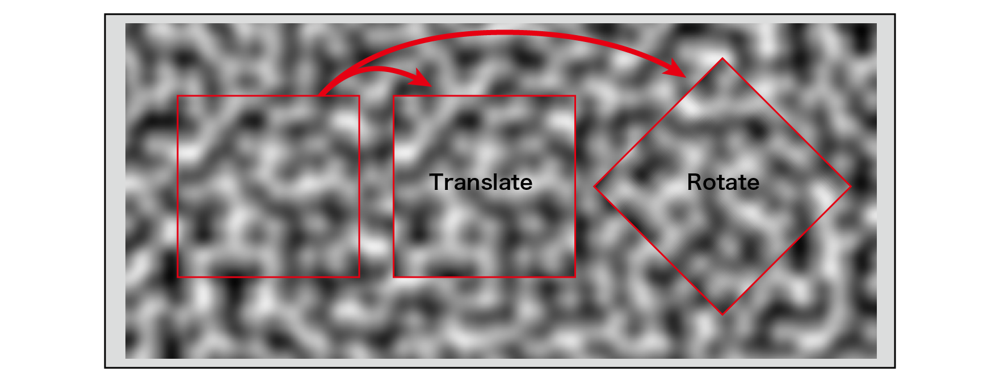

ノイズは、N次元のベクトルを入力として受けることで、以下のような用途に使用することができます。

- アニメーション ・・・ 1D（時間）
- テクスチャ ・・・ 2D（オブジェクトのUV座標）
- アニメーションするテクスチャ ・・・ 3D（オブジェクトのUV座標＋時間）
- ソリッド（3D）テクスチャ ・・・ 3D（オブジェクトのローカル座標）
- アニメーションするソリッドテクスチャ ・・・ 4D（オブジェクトのローカル座標＋時間）

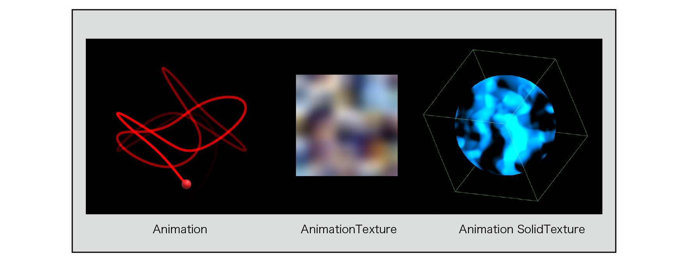

## ノイズのアルゴリズムについての解説
**Value Noise**、**Perlin Noise**、**Improved Perlin Noise（改良パーリンノイズ）**、**Simplex Noise**についてのアルゴリズムの解説を行っていきます。

### Value Noise (バリューノイズ)
ノイズ関数としての条件や精度を厳密には満たしていませんが、最も実装が容易でノイズについての理解を助けるものとして、**Value Noise**というノイズアルゴリズムを紹介します。

#### アルゴリズム
1. 空間上のそれぞれの軸に一定の間隔で配置された格子点を定義する
2. それぞれの格子点について、疑似乱数の値を求める
3. それぞれの格子点と格子点の間の点の値を、補間によって求める

##### 格子を定義
2次元の場合、x、y軸それぞれに等間隔な格子を定義します。格子は正方形の形状をしており、このそれぞれの格子点において、格子点の座標値を参照した疑似乱数の値を計算します。
3次元の場合は、x、y、z軸それぞれに等間隔な格子を定義し、格子の形状は立方体になります。
 
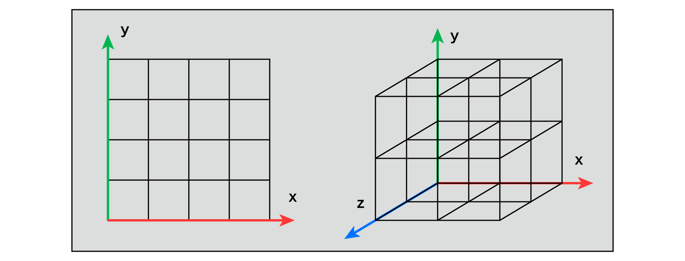

##### 疑似乱数（Pseudo Random）の生成
乱数というのは、無秩序に、出現の確率が同じになるように並べられた数字の列を言います。
乱数にも真の乱数と疑似乱数と呼ばれるものがあり、例えば、サイコロを振るとき、今まで出た目から次に出る目を予測することは不可能であり、このようなものを真の乱数と呼びます。これに対して、規則性と再現性があるものを、**疑似乱数（Pseudo Random）**と呼びます。（コンピュータで乱数列を生成する場合、確定的な計算で求めるので、生成された乱数はほとんどは疑似乱数ということができます。）
ノイズの計算を行う場合、共通のパラメータさえ用いれば、同じ結果が得られる疑似乱数を使用します。

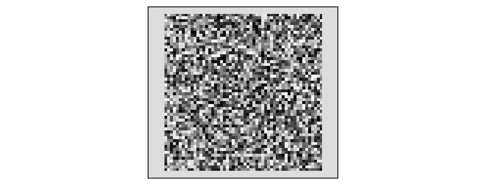

この擬似乱数を生成する関数の引数に、それぞれの格子点の座標値を与えることで、格子点ごとに固有の擬似乱数の値を得ることができます。


##### 補間（Interpolation）
AとBという値があり、その間のPの値が、AからBに直線的に変化するとして、その値を近似的に求めることを**線形補間（Linear Interpolation）**と言います。
もっとも単純な補間方法ですが、これを使って、格子点の間の値を求めるとすると、補間の始点と終点（格子点付近）で、値の変化が鋭利になってしまいます。

そこで、スムーズに値が変化するように、**3次エルミート曲線**を補間係数に使用します。

//texequation{
f\left( t\right) =3t^{2}-2t^{3}
//}

これを`t=0`から`t=1`へ変化させたとき、値は右下図のようになります。


※ 3次エルミート曲線は、GLSL、HLSLでは、**smoothstep**関数として実装されています。

この補間関数を使って、それぞれの格子点で求めた値をそれぞれの軸で補間します。
2次元の場合、まず格子の両端でxについての補間を行い、次にそれらの値をy軸についての補間し、合計3回の計算を行います。
3次元の場合は、下の図のように、z軸について4つ、y軸について2つ、x軸について1つ、合計7回の補間を行います。


#### 実装

2次元について説明いたします。
各格子点の座標を求めます。

```
floor()
```

整数部については、`floor()`関数を使って求めます。
`floor()`は、入力された実数に対してそれ以下の最小の整数を返す関数です。1.0以上の実数を入力値に与えた場合、1,2,3…という値が得られ等間隔に同じ値が得られるため、これを格子の座標値として用いることができます。

小数部については、`frac()`関数を使って求めます。

```
frac()
```

`frac()`は、与えられた実数値の、小数部の値を返し、0以上1未満の値をとります。
これにより、それぞれの格子内部の座標値を得ることができます。


```
// 格子点の座標値
float2 i00 = i;
float2 i10 = i + float2(1.0, 0.0);
float2 i01 = i + float2(0.0, 1.0);
float2 i11 = i + float2(1.0, 1.0);
```

上で求めた座標値を、フラグメントカラーのRとGに割り当てると以下のような画像が得られます。（整数部については、1以上の値を取り得るため、視覚化のため結果が1を超えないようにスケーリングを施しています）

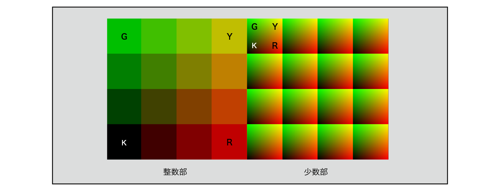


##### 疑似乱数生成関数

random関数をインターネットで検索すると、よくこの関数が結果として返されます。

```
float rand(float2 co)
{
    return frac(sin(dot(co.xy, float2(12.9898,78.233))) * 43758.5453);
}
```

1つ1つ処理を見ていくと、まず入力された2次元のベクトルを内積で1次元に丸め扱いやすくし、それをsin関数の引数として与え、大きな数を掛け合わせ、その小数部を求めるというもので、これにより、規則性と再現性はあるが、無秩序に連続した値を得ることができます。

この関数については、出自が定かではなく、

[https://stackoverflow.com/questions/12964279/whats-the-origin-of-this-glsl-rand-one-liner](https://stackoverflow.com/questions/12964279/whats-the-origin-of-this-glsl-rand-one-liner)

によると、1998年に発表された **"On generating random numbers, with help of y= [(a+x)sin(bx)] mod 1"** という論文という論文が起源であると書かれています。

シンプルで扱いやすい反面、同じ乱数列が出てきてしまう周期が短く、大きな解像度のテクスチャであると、視覚的に確認できてしまうパターンが発生し、あまり良い疑似乱数とは言えません。


```
// 格子点の座標上での疑似乱数の値
float n00 = pseudoRandom(i00);
float n10 = pseudoRandom(i10);
float n01 = pseudoRandom(i01);
float n11 = pseudoRandom(i11);
```
それぞれの格子点の座標値（整数）を、疑似乱数の引数に与えることで、各格子点上でのノイズの値を求めます。

##### 補間（Interpolation）

```
// 補間関数（3次エルミート曲線）= smoothstep
float2 interpolate(float2 t)
{
	return t * t * (3.0 - 2.0 * t);
}

```

```
// 補間係数を求める
float2 u = interpolate(f);
// 2次元格子の補間
return  lerp(lerp(n00, n10, u.x), lerp(n01, n11, u.x), u.y);

```
事前に定義した`interpolate()`関数で補間係数を算出します。格子の小数部を引数とすることで、格子の始点と終点付近で滑らかに変化する曲線が得られます。

`lerp()`は 線形補間を行う関数で、**Linear Interpolate**の略です。第1引数と第2引数に与えた値の線形補間された値を計算することができ、第3引数に補間係数として求めた**u**を代入することで、格子間の値を滑らかにつなげます。

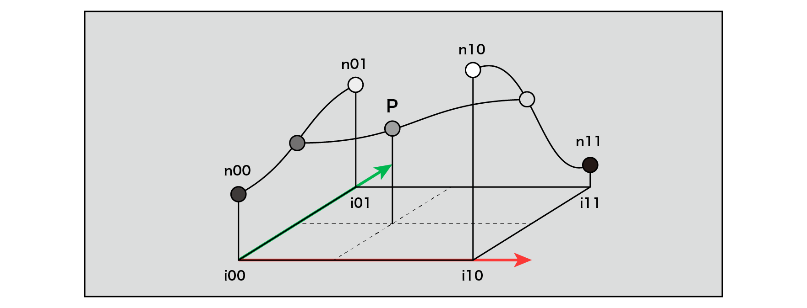

#### 結果
サンプルプロジェクト内の

TheStudyOfProceduralNoise/Scenes/**ShaderExampleList**

シーンを開くと、**Value Noise**の実装結果を見ることができます。
コードについては、

- Shaders/ProceduralNoise/**ValueNoise2D.cginc**
- Shaders/ProceduralNoise/**ValueNoise3D.cginc**
- Shaders/ProceduralNoise/**ValueNoise4D.cginc**

に実装をしたものがあります。

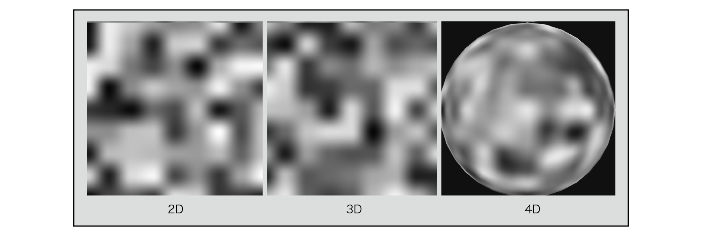

結果画像を見てみると、ある程度格子の形状が見えてしまうことがわかります。このように**Value Noise**は、実装は容易ですが、ある領域を回転させたときに特徴が不変であるという等方性が保証されておらず、ノイズというには不十分です。しかし、**Value Noise**の実装で行った、**「規則的に配置された格子点で求められた疑似乱数の値を補間して空間上のすべての点の連続的でスムースな値を求める」**というプロセスは、ノイズ関数の基本的なアルゴリズムの構造をしています。

### Perlin Noise (パーリンノイズ)

**Perlin Noise** は、プロシージャルノイズの伝統的、代表的手法であり、その名の主である**Ken Perlin**によって開発されました。
もともとは、世界で初めて全面的にコンピュータグラフィックスを導入した映画として知られる、1982年に製作されたアメリカのSF映画「Tron」の視覚表現ためのテクスチャ生成の実験の中で生み出され、その成果は、1985年のSIGGRAPHに **"An Image Synthesizer"** というタイトルの論文にまとめられ発表されました。

#### アルゴリズム
1. 格子（Lattice）の座標を求める
2. 格子点上の勾配（Gradient）を求める
3. 各格子点から、格子の中の点Pへのベクトルを求める
4. 2で求めた勾配と、3で求めたベクトルの内積を計算し、各格子点上のノイズの値を計算する
5. 3次エルミート曲線で、4で求めた各格子点のノイズの値を補間する

##### 勾配（Gradient）
Value Noiseと異なる点は、格子点のノイズの値を1次元の値で定義するのではなく、傾きを持った**勾配（Gradient）**として定義するところです。
2次元であれば2次元の勾配、3次元であれば3次元の勾配を定義します。

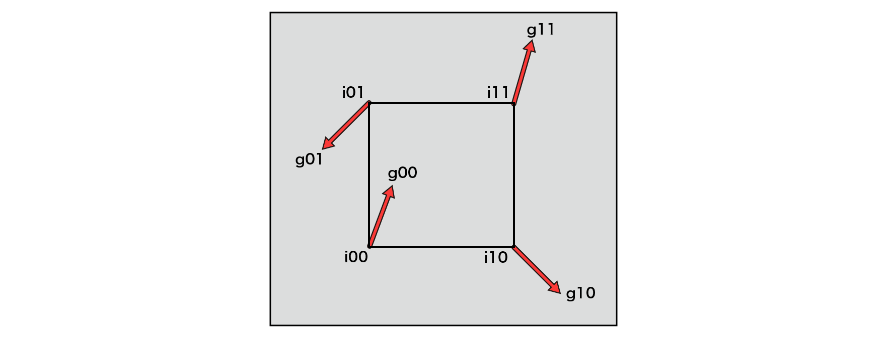

##### 内積（Dot Product）
内積は、
//texequation{
\overrightarrow {a}\cdot \overrightarrow {b}=\left| a\right| \left| b\right| \cos \theta
= \left( a.x\ast b.x\right) +\left( a.y\ast b.y\right)
//}
で定義されるベクトルの演算で、幾何学的な意味は、2つのベクトルがどれぐらい同じ方向を向いているかを示す比であり、内積のとる値は、**同じ方向→1**、**直交→0**、**逆向き→-1**となります。
つまり、勾配と、各格子点から格子内のノイズの値を求めたい点Pへ向かうベクトルの内積を求めるということは、それらのベクトルが同じ方向を向いていれば、高いノイズの値が、異なる方向を向いていれば小さい値が返されることになります。

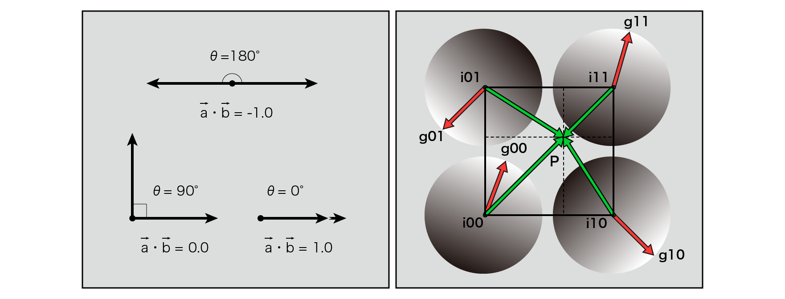

##### 補間（Interpolation）
ここでは、3次エルミート曲線を補間のための関数として用いていますが、後に、Ken Perlinは、5次エルミート曲線に修正しています。それについては、**Improved Perlin Noise（改良パーリンノイズ）**の項で説明いたします。

#### 実装
サンプルプロジェクト内の 

TheStudyOfProceduralNoise/Scenes/**ShaderExampleList** 

シーンを開くと、**Perlin Noise**の実装結果を見ることができます。
コードについては、

- Shaders/ProceduralNoise/**OriginalPerlinNoise2D.cginc**
- Shaders/ProceduralNoise/**OriginalPerlinNoise3D.cginc**
- Shaders/ProceduralNoise/**OriginalPerlinNoise4D.cginc**

に実装をしたものがあります。

2次元についての実装を掲載します。

```
// Original Perlin Noise 2D
float originalPerlinNoise(float2 v)
{
	// 格子の整数部の座標
	float2 i = floor(v);
	// 格子の小数部の座標
	float2 f = frac(v);

	// 格子の4つの角の座標値
	float2 i00 = i;
	float2 i10 = i + float2(1.0, 0.0);
	float2 i01 = i + float2(0.0, 1.0);
	float2 i11 = i + float2(1.0, 1.0);

	// 格子内部のそれぞれの格子点からのベクトル
	float2 p00 = f;
	float2 p10 = f - float2(1.0, 0.0);
	float2 p01 = f - float2(0.0, 1.0);
	float2 p11 = f - float2(1.0, 1.0);

	// 格子点それぞれの勾配
	float2 g00 = pseudoRandom(i00);
	float2 g10 = pseudoRandom(i10);
	float2 g01 = pseudoRandom(i01);
	float2 g11 = pseudoRandom(i11);

	// 正規化（ベクトルの大きさを1にそろえる）
	g00 = normalize(g00);
	g10 = normalize(g10);
	g01 = normalize(g01);
	g11 = normalize(g11);

	// 各格子点のノイズの値を計算
	float n00 = dot(g00, p00);
	float n10 = dot(g10, p10);
	float n01 = dot(g01, p01);
	float n11 = dot(g11, p11);

	// 補間
	float2 u_xy = interpolate(f.xy);
	float2 n_x  = lerp(float2(n00, n01), float2(n10, n11), u_xy.x);
	float2 n_xy = lerp(n_x.x, n_x.y, u_xy.y);
	return n_xy;
}
```
#### 結果

**Value Noise**で見られたような不自然な格子の形状はなく、等方性のあるノイズが得られます。**Perlin Noise**は、**Value Noise**に対して、勾配を用いることから**Gradient Noise**とも呼ばれます。

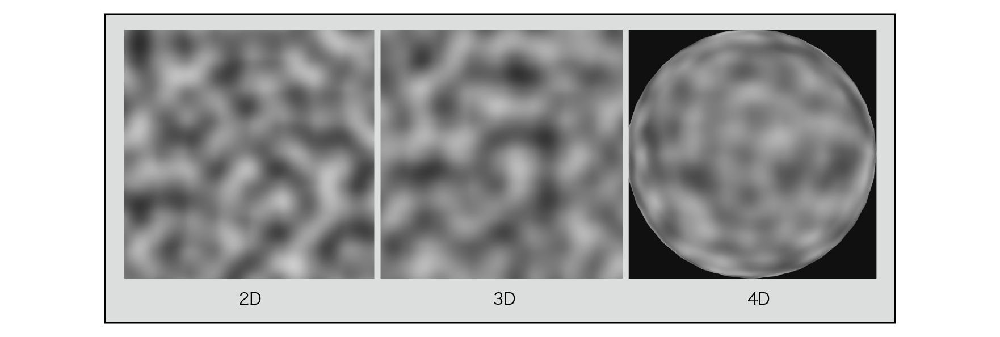

### Improved Perlin Noise (改良パーリンノイズ)
**Improved Perlin Noise（改良パーリンノイズ）**は、Ken Perlin氏によって、**Perlin Noise**の欠点を改良するものとして2001年に発表されました。詳細については、ここで確認することができます。

[http://mrl.nyu.edu/~perlin/paper445.pdf](http://mrl.nyu.edu/~perlin/paper445.pdf)

現在、**Perlin Noise**というと、この**Improved Perlin Noise**に基づいて実装されたものがほとんどです。

Ken Perlinが行った改良とは、主に次の2点です。

1. 格子間の勾配の補間のための補間関数
2. 勾配の計算法

##### 格子間の勾配の補間のための補間関数
補間のエルミート曲線について、オリジナルの**Perlin Noise**では**3次エルミート曲線**を用いました。
しかし、この3次の式であると、2階微分（微分して得られた結果がさらに微分可能なとき、これを微分する事）`6-12t`が`t=0`, `t=1`の時に`0`になりません。
曲線を微分すると、接線の傾きが得られます。もう1回微分すると、その曲率が得られ、これがゼロでないということはわずかな変化があるということです。
このため、バンプマッピングのための法線として用いる場合、隣接する格子と値が厳密に連続にならなず、視覚的なアーティファクトが発生します。

比較した図です。
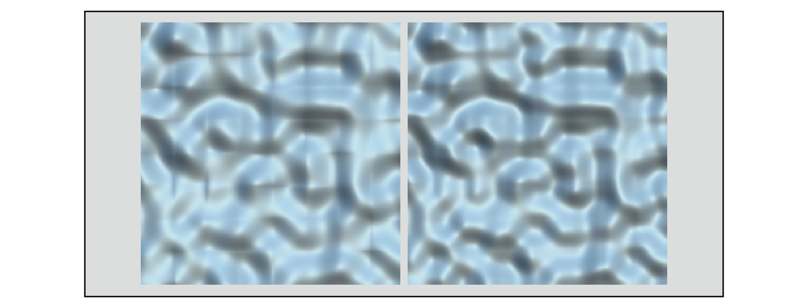

サンプルプロジェクト

TheStudyOfProceduralNoise/Scenes/**CompareBumpmap**

シーンを開くと、これを確認することができます。

図を見てみると、左の**3次エルミート曲線**によって補間を行った方は、格子の境界で視覚的に不自然な法線の不連続が認められます。
これを回避するために、次の**5次エルミート曲線**を用います。

//texequation{
f\left( t\right) =6t^{5}-15t^{4}+10t^{3}
//}

それぞれの曲線図を示します。
①は**3次エルミート曲線**、②は**5次エルミート曲線**です。

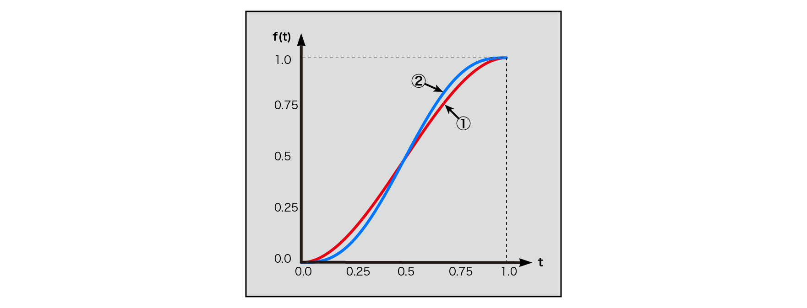

`t=0`, `t=1`あたりでなめらな変化をしていることがわかります。
1階微分、2階微分ともに`t=0`または`t=1`の時に`0`となるので、連続性が保たれます。

##### 勾配の計算
3次元について考えます。
勾配Gは球状に均一に分布していますが、立方体格子はその軸に対しては短く、その対角線については長く、それ自体方向的な偏りを持っています。
勾配が軸と平行に近い場合、それが近接するものと整列すると、距離が近いためそれらの領域では異常に高い値をとなり、斑点に見えるようなノイズの分布を生じさせることがあります。
この勾配の偏りを取り除くために、座標軸に平行なものと、対角線上にあるものを取り除いた以下の12のベクトルに限定することを行います。

```
(1,1,0),(-1,1,0),(1,-1,0),(-1,-1,0),
(1,0,1),(-1,0,1),(1,0,-1),(-1,0,-1),
(0,1,1),(0,-1,1),(0,1,-1),(0,-1,-1) 
```


認知心理学的な見地から、実際には、格子の中の点Pが十分なランダム性を与えてくれるのもあり、勾配Gが全方位にランダムである必要はないとKen Perlinは述べています。また、たとえば、`(1, 1, 0)`と`(x, y, z)`の内積は、単純に`x + y`として計算することができ、後に行う内積計算を単純化し、多くの乗算を避けることができます。
これによって24個の乗算が計算から取り除かれ、計算コストを抑えることができます。

#### 実装と結果
サンプルプロジェクト内の

TheStudyOfProceduralNoise/Scenes/**ShaderExampleList**

シーンを開くと、**Improved Perlin Noise**の実装結果を見ることができます。
コードについては、

- Shaders/ProceduralNoise/**ClassicPerlinNoise2D.cginc**
- Shaders/ProceduralNoise/**ClassicPerlinNoise3D.cginc**
- Shaders/ProceduralNoise/**ClassicPerlinNoise4D.cginc**

この**Improved Perlin Noise**の実装は、次の**Simplex Noise**でも紹介する、論文**"Effecient computational noise in GLSL"** において発表されたものに基づいています。（ここでは、**Classic Perlin Noise**という名称で扱われています。そのため、少しややこしいですが、その名前を使用しています。）。この実装は、勾配計算について、Ken Perlinが論文で説明したものとは異なりますが、十分に類似した結果を得ることができます。

下記のURLからKen Perlin のオリジナルの実装を確認することができます。

[http://mrl.nyu.edu/~perlin/noise/](http://mrl.nyu.edu/~perlin/noise/)


下の図は、ノイズの勾配と結果を比較したものです。左がオリジナルの**Perlin Noise**、右が**Improved Perlin Noise**です。
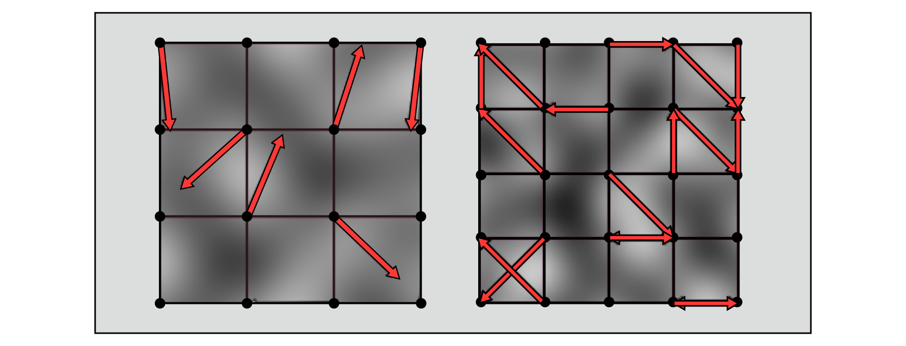


### Simplex Noise (シンプレックスノイズ)
**Simplex Noise**は、Ken Perlinによって、従来の**Perlin Noise**よりも優れたアルゴリズムとして2001年に発表されました。

**Simplex Noise**は従来の**Perlin Noise**と比較して、以下のような優位性があります。

- 計算の複雑性が低く、乗算の回数が少ない。
- ノイズの次元を4次元、5次元またはそれ以上と上げていったとき、計算負荷の増加が少なく、**Perlin Noise**が@<m>{O(2^{N\\})}の計算オーダーであるところ、**Simplex Noise**は@<m>{O(N^{2\\})}で済む
- 勾配ベクトルの方向的な偏りが引き起こす視覚的なアーティファクトがない
- 少ない計算負荷で、連続的な勾配がある
- ハードウェア（シェーダ）で実装しやすい

ここでは、
**"Simplex Noise Demystify"**

[http://staffwww.itn.liu.se/~stegu/simplexnoise/simplexnoise.pdf](http://staffwww.itn.liu.se/~stegu/simplexnoise/simplexnoise.pdf)

の内容をもとに解説いたします。


#### アルゴリズム
1. 単体（Simplex）による格子を定義する
2. ノイズの値を求める点Pがどの単体にあるかを計算
3. 単体の角における勾配を計算
4. それぞれの単体の周囲の角における勾配の値から、点Pにおけるノイズの値を計算

##### 単体(Simplex)による格子
シンプレックスとは、数学の位相幾何学においては、単体と呼ばれます。単体とは、図形を作る一番小さな単位のことです。
0次元単体は**点**、1次元単体は**線分**、2次元単体は**三角形**、3次元単体は**四面体**、4次元単体は**五胞体**です。

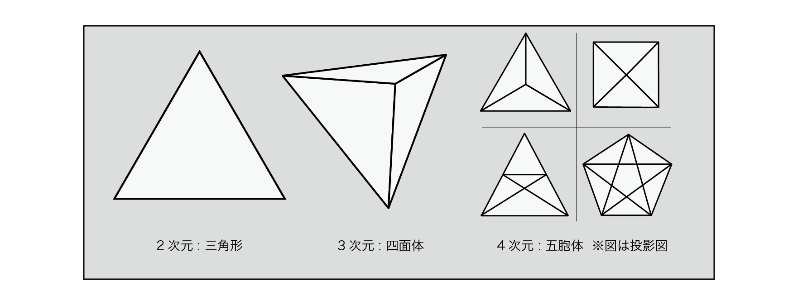

**Perlin Noise**では、2次元の時は正方形の格子、3次元の時は立方体の格子を用いていましたが、**Simplex Noise**ではこの単体を格子に使います。

1次元の場合、空間を充てんする最も単純な形状は、等間隔に配置された線です。2次元の場合、空間を充てんする最も単純な形状は三角形となります。

これらの三角形で構成されたタイルのうち二つは、その主対角線に沿って押しつぶされた正方形と考えることができます。

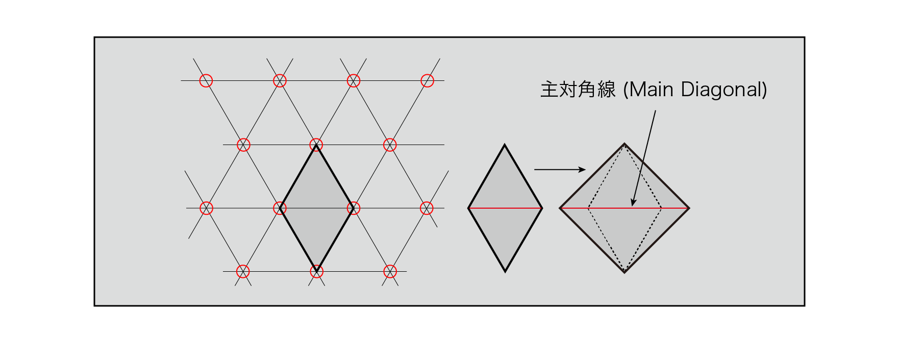

3次元では、単体形状はわずかに歪んだ四面体です。それら6つの四面体は主対角線に沿って押しつぶされた立方体を作ります。


4次元では、単体形状は非常に視覚化が困難です。その単体形状は5つの角を持っており、24個のこれらの形状が、主対角線に沿ってつぶれた4次元の超立方体を形成します。

N次元の単体形状は、**N+1**個の角を持ち、**N!（3!は3×2×1=6)**個のそれらの形状は、主対角線に沿ってつぶれたN次元超立方体を満たす、と言えます。

格子に単体形状を用いる利点は、次元に対して可能な限り少ない角をもつ格子を定義できるので、格子の内部の点の値を求めるとき、周囲の格子点の値から補間を行いますが、その計算回数を抑えることができるところにあります。N次元の超立方体は@<m>{2^{N\\}}個の角を持ちますが、N次元の単体形状は@<m>{N+1}個だけの角しか持ちません。

より高い次元のノイズの値を求めようとするとき、従来の**Perlin Noise**では、超立方体のそれぞれの角における計算の複雑性や、それぞれの主軸についての補間の計算量は@<m>{O(2^{N\\})}問題であり、すぐに扱いにくいものになります。一方、**Simplex Noise**では、次元に対する単体形状の頂点数が少ないため、その計算量は@<m>{O(N^{2\\})}に抑えられます。

##### ノイズの値を求める点Pが、どの単体にあるかの決定
Perlin Noiseでは、求めたい点Pが、どの格子にあるかの計算は、座標の整数部を`floor()`で求めることができました。Simplex Noiseでは、以下に示す2つの手順で行います。

1. 主対角線に沿って入力座標空間を歪曲させ、それぞれの軸の座標の整数部を見ることで、どの単体のユニットに属するかを判断する
2. 単体のユニットの原点から、点Pへのそれぞれの次元での距離の大きさを比較することで、単体のユニットのどの単体に属するかを判断する

視覚的な理解のために、2次元の場合についての図を見ていきましょう。

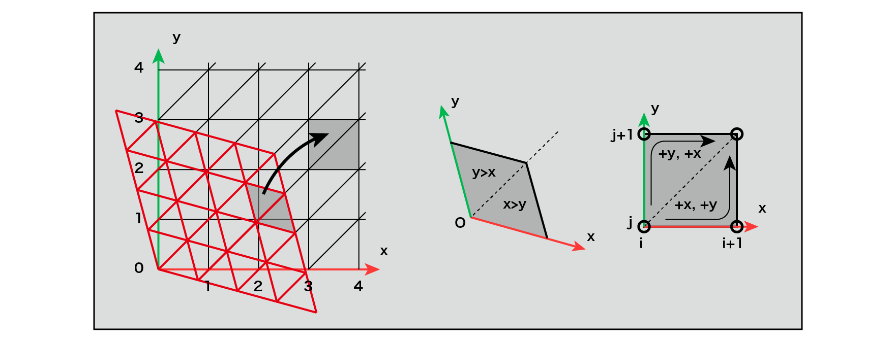

2次元の三角形の単体格子は、スケーリングによって二等辺三角形の格子にゆがめることができます。
二等辺三角形は2つで辺の長さが1の四角形（単体のユニットというのはこの四角形を指します）を形成します。移動後の座標`(x, y)`の整数部を見ることによって、ノイズの値を求めたい点Pがどの単体のユニットの四角形にあるかを判断することができます。また、単体のユニットの原点からのx、yの大きさを比較することによって、点Pを含む単体がユニットのどちらであるかがわかり、点Pを囲む単体の3点の座標が決まります。

3次元の場合、2次元の正三角形の単体格子を二等辺三角形の格子へと変形させることができるように、3次元の単体格子は、その主対角線に沿ってスケーリングすることで、規則正しく並んだ立方体の格子に変形させることができます。2次元の場合と同様、移動した点Pの座標の整数部を見ることで、どの6個からなる単体のユニットに属するかを判定できます。そしてさらに、そのユニットのどの単体に属するかは、ユニットの原点からの各軸の相対的な大きさ比較で判定することができます。

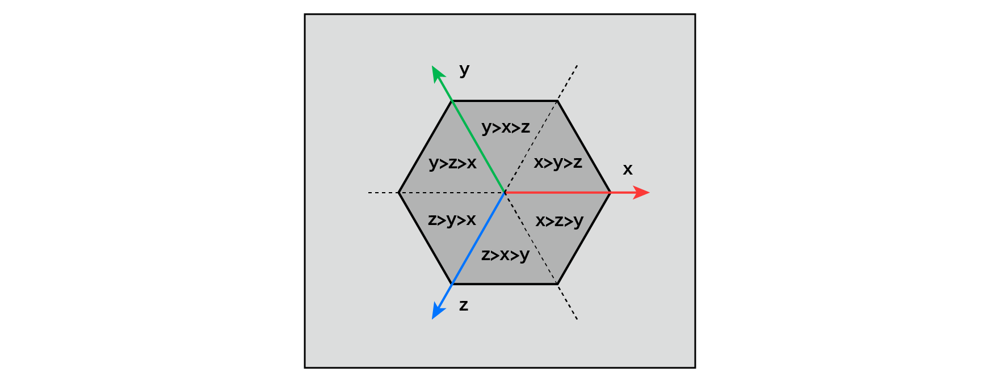

この上の図は、3次元の単体のユニットが作る立方体を主対角線に沿って見たものであり、点Pの座標値のx、y、z軸についてのそれぞれの大きさによってどの単体に属するのかのルールを示したものです。

4次元の場合、視覚化は困難ですが、2次元と3次元の規則と同様に考えることができます。空間を満たす4次元の超立方体の座標`(x, y, z, w)`それぞれの軸についての大きさの組み合わせは、4!=24通りとなり、超立方体内の24個の単体それぞれに固有のものとなり、点Pがどの単体に属するかを判定することができます。

下の図は、2次元における単体格子をフラグメントカラーで可視化したものです。


##### 補間から総和への移行
従来の**Perlin Noise**では、格子内部の点の値を周囲の格子点の値から補間によって求めていました。しかし、**Simplex Noise**では、代わりに、それぞれの単体形状の頂点の値の影響度合いを、単純な総和計算で求めます。具体的には、単体それぞれの角の**勾配の外挿**と、**各頂点からの距離によって放射円状に減衰する関数**の積の足しあわせを行います。

2次元について考えます。

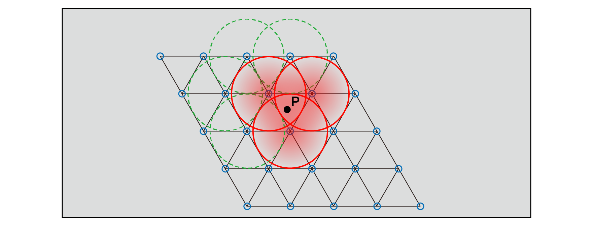

単体の内部の点Pの値は、それを囲んでいる単体の3つの各頂点からの値のみ影響します。離れた位置にある頂点の値は、点Pを含んだ単体の境界を越える前に0に減衰するので、影響を及ぼしません。このように、点Pのノイズの値は、3つの頂点の値とその影響度合いの合計として計算することができます。


#### 実装
実装については、2012年に、Ian McEwan、David Sheets、 Stefan Gustavson
、Mark Richardsonによって発表された **"Effecient computational noise in GLSL"** 

[https://pdfs.semanticscholar.org/8e58/ad9f2cc98d87d978f2bd85713d6c909c8a85.pdf](https://pdfs.semanticscholar.org/8e58/ad9f2cc98d87d978f2bd85713d6c909c8a85.pdf)

に従った方法で示します。

現状、シェーダによるノイズの実装を行いたい場合、ハードウェア依存が少なく、計算も効率的で、テクスチャを参照するなどの必要がなく扱いやすいアルゴリズムです。（おそらく）

ソースコードは2018年4月現在、
[https://github.com/stegu/webgl-noise/](https://github.com/stegu/webgl-noise/)
で管理されています。オリジナルはこちら([https://github.com/ashima/webgl-noise](https://github.com/ashima/webgl-noise))でしたが、現在これを管理していた Ashima Arts は会社として機能していないようなので、Stefan Gustavsonによってクローンされました。

実装の特徴としては、以下の3つが挙げられます。

- 勾配ベクトル計算のためのランダムに並んだインデックスを、テーブルを参照するのではなく、多項式による計算で求める
- 正軸体（Cross Polytope）の幾何学形状を勾配ベクトル計算に用いる
- 単体選択の条件を順序付け（Rank Ordering）と置き換える

##### 勾配のインデックス並べ換えのための多項式
過去に発表されたノイズの実装では、勾配計算時のインデックス生成のために、事前に計算されたインデックスの値を格納したテーブルやビット入れ替えによるハッシュを使っていたりしましたが、どちらのアプローチもシェーダによる実装には向いているとは言えません。そこで、インデックス並べ替えのために、
//texequation{
\left( Ax^{2}+Bx\right) mod\ M
//}
というシンプルな形をした多項式を使用する方法を提案しています。（mod=modulo ある数を割った時の余りの数（剰余））
例えば、@<m>{\left(6x^{2\\}+x\right)mod\ 9}は `（0 1 2 3 4 5 6 7 8)` を `(0 7 8 3 1 2 6 4 5)` というように、0~8の入力に対して重複のない0~8の9つの数字を返します。

勾配を十分に良く分散するためのインデックス生成には、少なくとも数百の数字を並べ替える必要があり、
@<m>{\left(34x^{2\\}+x\right)mod\ 289}
を選択することとします。

この置換多項式は、シェーダ言語の変数の精度の問題で、整数領域で、@<m>{34x^{2\\}+x > 2^{24\\}}, または、@<m>{|x| > 702} の時に、切り捨てが発生してしまいます。
そこで、オーバーフローのリスクなしに並べ替えのための多項式を計算するために、多項式の計算を行う前に、xの289の剰余計算を行って、xを0~288の範囲に制限します。

具体的には、以下のように実装されます。

```
// 289の剰余を求める
float3 mod289(float3 x)
{
	return x - floor(x * (1.0 / 289.0)) * 289.0;
}

// 置換多項式による並べ替え
float3 permute(float3 x)
{
	return fmod(((x * 34.0) + 1.0) * x, 289.0);
}
```

論文では、2、3次元のときは問題ないが、4次元の場合は、この多項式では視覚的なアーティファクトが発生してしまっていることを認めています。4次元の場合、289のインデックスでは不十分であるようです。

#####  正軸体（Cross Polytope）の幾何学形状を勾配ベクトル計算に用いる
従来の実装では、勾配計算に疑似乱数を使用し、事前に計算した勾配のインデックスの計算のために、インデックスを格納したテーブルを参照したり、ビット操作を行ったりしました。ここでは、よりシェーダによる実装に最適で、さまざまな次元で効率よく分散した勾配を得るために、**正軸体（Cross Polytope)**を勾配計算に使用します。
正軸体とは、2次元の**正方形**、3次元の**正八面体**、4次元の**正十六胞体**を各次元に一般化した形状の事を指します。
各次元下図のような幾何学的形状をとります。


勾配ベクトルは、それぞれの次元で、2次元であれば**正方形**、3次元であれば**正八面体**、4次元であれば（一部切り詰められた）**正十六胞体**の**表面上**に分散します。


各次元、方程式は以下の通りです。

```
2-D: x0 ∈ [−2, 2], y = 1 − |x0|
if y > 0 then x = x0 else x = x0 − sign(x0)

3-D: x0, y0 ∈ [−1, 1], z = 1 − |x0| − |y0|
if z > 0 then x = x0, y = y0
else x = x0 − sign(x0), y = y0 − sign(y0)

4-D: x0, y0, z0 ∈ [−1, 1], w = 1.5 − |x0| − |y0| − |z0|
if w > 0 then x = x0, y = y0, z = z0
else x = x0 − sign(x0), y = y0 − sign(y0), z = z0 − sign(z0)
```

##### 勾配の正規化
ほとんどの**Perlin Noise**の実装では大きさが等しい勾配ベクトルを使っていました。しかし、N次元の正軸体の表面のベクトルの最短のものと最長のものでは、@<m>{\sqrt {N\\}}の因数分、長さに差があります。これは強いアーティファクトを引き起こしませんが、次元が高くなると、このベクトルを明示的に正規化しなければノイズパターンの等方性が低くなってしまいます。正規化とは、ベクトルをそのベクトルの大きさで割ることにより、大きさを1にそろえる処理です。勾配ベクトルの大きさをrとすると、勾配ベクトルにrの逆平方根 @<m>{\dfrac {1\\}{\sqrt {r\\}\\}} を掛け合わせることで、正規化が実現できます。ここでは、パフォーマンス向上のため、この逆平方根をテイラー展開を用いて近似的に計算しています。
テイラー展開とは、無限に微分可能な関数において、xがaの近辺であるなら、以下の式で近似的に計算できる、というものです。

//texequation{
\sum ^{\infty }_{n=0}\dfrac {f^{\left( n\right) }\left( a\right) }{n!}\left( x-a\right) ^{n}
//}

@<m>{\dfrac {1\\}{\sqrt {a\\}\\}} の1階微分を求めると、

//texequation{
\begin{array}{l}
f\left( a\right) =\dfrac {1}{\sqrt {a}}=a^{-\frac{1}{2}}\\\
f'\left( a\right) =-\dfrac {1}{2}a^{-\frac{3}{2}}\\\
\end{array} 
//}

となり、
テイラー展開によるa近辺での近似式は以下のようになります。

//texequation{
\sum ^{\infty }_{n=0}\dfrac {f^{\left( n\right) }\left( a\right) }{n!}\left( x-a\right) ^{n}
//}

//texequation{
\begin{array}{l}
=a^{-\frac{1}{2}}-\frac{1}{2}a^{-\frac{3}{2}}\left( x-a\right)\\\
=\frac{3}{2}a^{-\frac{1}{2}}-\frac{1}{2}a^{-\frac{3}{2}}x\\\
\end{array} 
//}

ここで、a=0.7(勾配ベクトルの長さの範囲が0.5～1.0であるからなんだろうと思います)とすると、@<m>{1.79284291400159 - 0.85373472095314 * x} が得られます。


実装ではこのようになっています。

```
float3 taylorInvSqrt(float3 r)
{
	return 1.79284291400159 - 0.85373472095314 * r;
}
```

### 実装と結果

サンプルプロジェクト内の

TheStudyOfProceduralNoise/Scenes/**ShaderExampleList** 

シーンを開くと、**Simplex Noise**の実装結果を見ることができます。
実装したコードは、

- Shaders/ProceduralNoise/**SimplexNoise2D.cginc**
- Shaders/ProceduralNoise/**SimplexNoise3D.cginc**
- Shaders/ProceduralNoise/**SimplexNoise4D.cginc**

にあります。

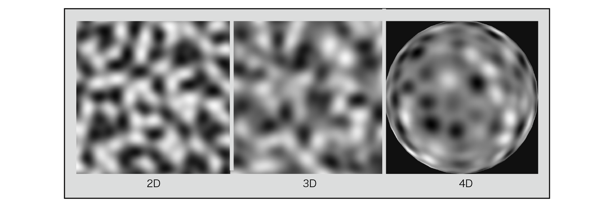

**Simplex Noise**は、**Perlin Noise**と比較すると、少し粒感のある結果が得られます。

## まとめ
プロシージャルノイズの代表的手法のアルゴリズムと実装について詳細に見てきましたが、それぞれ得られるノイズパターンの特徴や、計算コストに違いがあることが確認できたと思います。リアルタイムアプリケーションにおいてノイズを用いる場合、それが高解像度となるときは、画素一つ一つに対して計算を行うため、この計算負荷については無視することはできず、どのような計算がなされているかは、ある程度留意しておく必要があります。最近では、ノイズ関数がはじめから開発環境に組み込まれているものも多いですが、それを十分に使いこなすためにも、ノイズのアルゴリズムを理解しておくことは重要です。
ここではその応用については解説できませんでしたが、グラフィックス生成において、ノイズの応用は極めて多岐にわたり多大な効果をもたらします。（次章ではその例の一つを示します。）この記事が、数え切れないほどの応用への足がかりとなれば幸いです。
最後に、先人たちが積み上げてきた知恵と、主にKen Perlinの素晴らしい業績について敬意を表したいと思います。

## 参照
* [1] An Image Synthesizer, Ken Perlin, SIGGRAPH 1985

* [2] Improving Noise, Ken Perlin ―
[http://mrl.nyu.edu/~perlin/paper445.pdf](http://mrl.nyu.edu/~perlin/paper445.pdf)

* [3] Noise hardware. In Real-Time Shading SIGGRAPH Course Notes, Ken Perlin, 2001 ― 
[https://www.csee.umbc.edu/~olano/s2002c36/ch02.pdf](https://www.csee.umbc.edu/~olano/s2002c36/ch02.pdf)

* [4] Improved Noise reference implementation, Ken Perlin, SIGGRAPH 2002
[http://mrl.nyu.edu/~perlin/noise/](http://mrl.nyu.edu/~perlin/noise/)

* [5] GPU Gems Chapter 5. Implementing Improved Perlin Noise, Ken Perlin ―
[http://developer.download.nvidia.com/books/HTML/gpugems/gpugems_ch05.html](http://developer.download.nvidia.com/books/HTML/gpugems/gpugems_ch05.html)

* [6] Simplex noise demystified. Technical Report, Stefan Gustavson, 2005 ―
[http://staffwww.itn.liu.se/~stegu/simplexnoise/simplexnoise.pdf](http://staffwww.itn.liu.se/~stegu/simplexnoise/simplexnoise.pdf)

* [7] Efficient computational noise in GLSL, Ian McEwan, David Sheets, Stefan Gustavson and Mark Richardson, 6 Apr 2012 ―
[http://webstaff.itn.liu.se/~stegu/jgt2012/article.pdf](http://webstaff.itn.liu.se/~stegu/jgt2012/article.pdf)

* [8] Direct computational noise in GLSL Supplementary material, Ian McEwan, David Sheets, Stefan Gustavson and Mark Richardson, 2012 ― [http://weber.itn.liu.se/~stegu/jgt2011/supplement.pdf](http://weber.itn.liu.se/~stegu/jgt2011/supplement.pdf)

* [9] Texturing and Modeling; A Procedural Approach, Second Edition ―


* [10] The Book of Shaers  Noise, Patricio Gonzalez Vivo & Jen Lowe ― 
[https://thebookofshaders.com/11/](https://thebookofshaders.com/11/)

* [11] Building Up Perlin Noise ー 
[http://eastfarthing.com/blog/2015-04-21-noise/](http://eastfarthing.com/blog/2015-04-21-noise/)

* [12] Zで行こう！Extension for 3ds Max ２０１５を調べてみた その24 3dsmax 2015 ー [http://blog.livedoor.jp/take_z_ultima/archives/2015-05.html](http://blog.livedoor.jp/take_z_ultima/archives/2015-05.html)